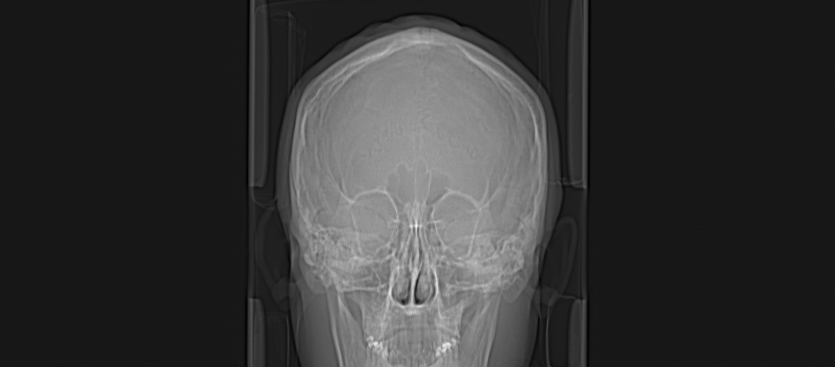
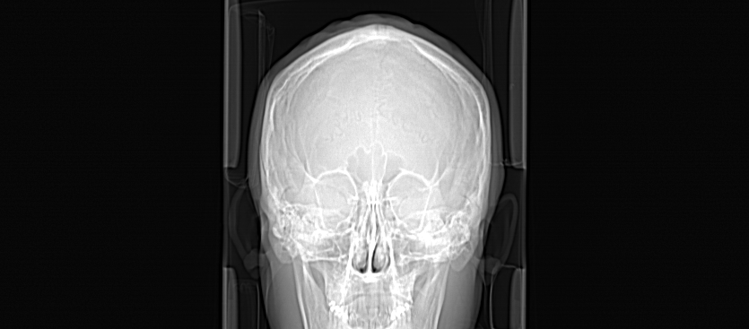
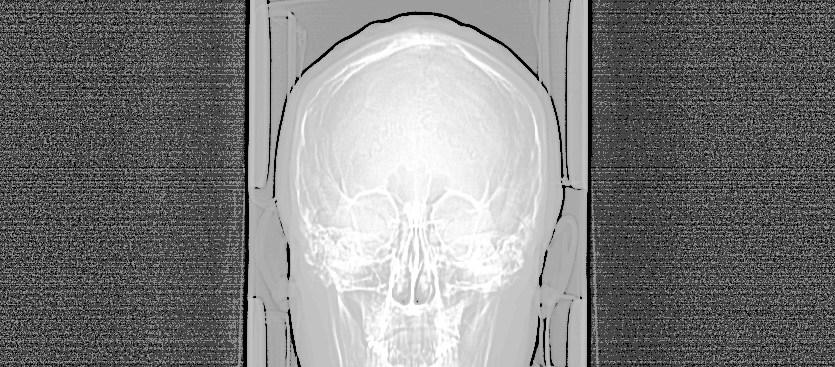
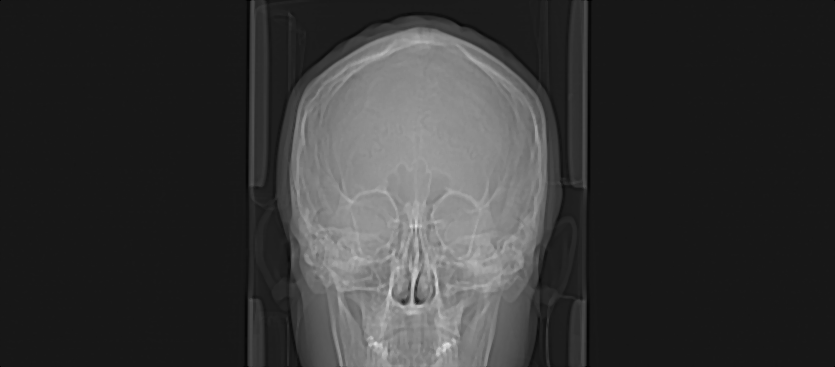
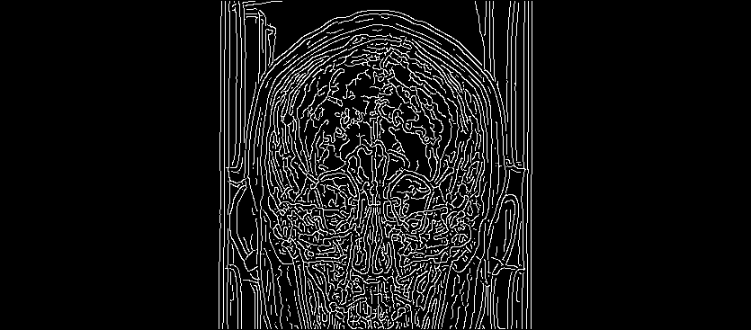
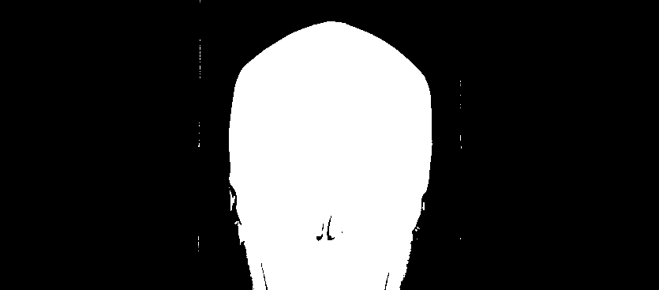

#  معالجة صور CT بصيغة DICOM باستخدام MATLAB

>  تتوفر ترجمات أخرى:  
> 🇺🇸 [English – النسخة الإنجليزية](README.md) | 🇩🇪 [Deutsch – النسخة الألمانية](README.de.md)

يوضح هذا المشروع خطوات المعالجة المبدئية وتحسين الجودة لصورة طبية بصيغة DICOM باستخدام برنامج MATLAB. تشمل الخطوات تحسين التباين، تسوية المدرج التكراري، إزالة الضوضاء، كشف الحواف، والتحويل إلى صورة ثنائية.

---

## 📁 المدخلات

- `I0.dcm` – صورة CT طبية بصيغة DICOM (تصوير جمجمة)
- تمت معالجتها باستخدام الملف: `process_dicom.m`

---

## ⚙️ التقنيات المستخدمة

| الخطوة | الوصف | النتيجة |
|--------|-------|----------|
| 1️⃣ | عرض الصورة الأصلية |  |
| 2️⃣ | تحسين التباين باستخدام `imadjust` |  |
| 3️⃣ | تسوية المدرج التكراري باستخدام `histeq` |  |
| 4️⃣ | فلترة الضوضاء باستخدام `medfilt2` |  |
| 5️⃣ | كشف الحواف باستخدام خوارزمية Canny |  |
| 6️⃣ | تحويل إلى صورة ثنائية باستخدام `imbinarize` |  |

---

##  ملاحظات

- تم استخدام أوامر MATLAB المدمجة فقط بدون أي مكتبات خارجية.
- تم حفظ كل خطوة في صورة مستقلة لتسهيل المقارنة.
- يمكن توسيع المشروع لاحقًا ليشمل خطوات متقدمة مثل: التقسيم (segmentation) أو استخراج الخصائص (features).

---

##  تنفيذ المشروع بواسطة

**وسن قصي حسن**  
مهندسة طبية حيوية  
GitHub: [wasan-biomed](https://github.com/wasan-biomed)
